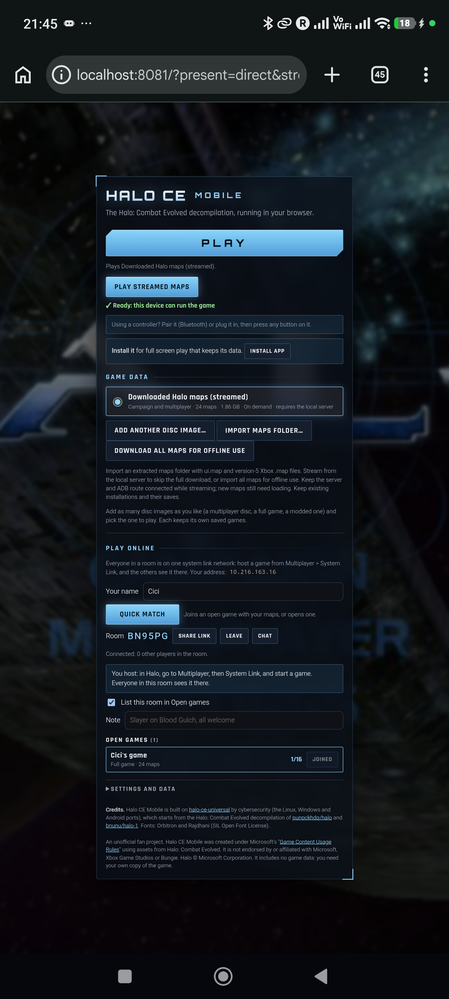

# 🔥 Halo Mobile

### 🚀 Halo: Combat Evolved. In your browser. On your phone. 🚀

 

> **A mobile-first Halo CE web port with touch controls, controllers, browser saves, streamed maps, System Link play, and a real Play button at the top.**
>
> **No installer. No native app package. Just WebAssembly doing something it absolutely should not be able to do.**

┌──────────────────────────────────────────────┐
│  🎮  PLAY HALO CE FROM A BROWSER TAB          │
│  📱  TOUCH. CONTROLLER. KEYBOARD.             │
│  🌐  STREAM MAPS. KEEP SAVES. JOIN FRIENDS.   │
└──────────────────────────────────────────────┘

---

## 🤯 What Is This?

Halo Mobile takes the Halo: Combat Evolved decompilation and pushes it through a modern browser stack: **WebAssembly**, **WebGL 2**, **OffscreenCanvas**, **OPFS**, service workers, and a launcher built for phones.

The result is an installable browser game with direct Play controls, private on-device storage, custom touch layouts, controller support, and multiplayer System Link rooms. Yes, that is a campaign-capable Halo port. Yes, that is a browser tab. 🤯

> 🧠 **TL;DR:** bring authorized game data, open the launcher, hit **Play**, and let the browser carry the absurdly large energy sword.

## 📱 This Is Not A Mockup

  
   
  <b>📲 Android launcher</b> — Play and streamed-map controls are first. Game-data controls stay below.

## 🌍 What Can You Do With It?

| ⚡ | Mission | What happens |
|---|---|---|
| 📱 | **Play on Android** | Run the WebAssembly build in current Chrome with touch controls. |
| 🍎 | **Install on iPhone or iPad** | Add the PWA to the Home Screen for a full-screen app-like experience. |
| 🎮 | **Use a controller** | Pair Bluetooth or USB controllers and let touch controls step aside. |
| 🕹️ | **Use keyboard + mouse** | Play on a desktop browser or a tablet with peripherals. |
| 💾 | **Keep saves locally** | Store saves, settings, and shader caches in private browser storage. |
| 📦 | **Import private game data** | Choose an authorized disc image or an extracted maps folder. |
| 📡 | **Stream maps on demand** | Use a separately hosted byte-range map service instead of importing every map. |
| 🤝 | **Play System Link** | Create, join, share, and match into browser-based Halo rooms. |
| 🧪 | **Try direct presentation** | Use the experimental direct worker-canvas mode for reduced frame transport. |
| 🛠️ | **Build the whole thing** | Compile the web port with Emscripten and Ninja. |

## ⚡ Quick Start

> **The shortest path from clone to “why is Halo running in my browser?”**

    # 🔓 Get the source
    git clone https://github.com/OMG-Guest/Halo-Mobile.git
    cd Halo-Mobile

    # 🧰 Install and activate Emscripten 6.0.10
    git clone --depth 1 https://github.com/emscripten-core/emsdk.git ../emsdk
    python3 ../emsdk/emsdk.py install 6.0.10
    python3 ../emsdk/emsdk.py activate 6.0.10
    source ../emsdk/emsdk_env.sh

    # 🚀 Build and test
    python3 configure.py --release
    ninja web
    node --test port/web/tests/*.cjs

The browser app is written to build/web/site. Serve it locally:

    # 🌐 Launch a local server
    python3 -m http.server --directory build/web/site 8081

Open http://localhost:8081. The service worker reloads once to establish browser isolation. Then you are flying. ✈️

## 🗺️ Bring Your Own Game Data

> **The code is here. The game data is not. Keep it that way.**

This repository includes **zero** Halo maps, disc images, saves, credentials, or generated builds. Supply compatible Halo game data only from a source you are authorized to use.

| 🔐 | Launcher route | Result |
|---|---|---|
| 💿 | **Choose disc image** | Import an authorized ISO or XISO into private browser storage. |
| 📁 | **Import maps folder** | Select an extracted compatible maps directory. |
| 📡 | **Play streamed maps** | Point the launcher at a separately hosted downloaded-maps manifest with HTTP byte ranges. |

Do not commit map files, disc images, browser saves, credentials, or build output. **Ever.**

## 🧱 Architecture

    ┌──────────────────────────────────────────────────────────┐
    │ 📱 Browser launcher                                       │
    │ Play • Touch • Controller • Install • System Link rooms  │
    └───────────────────────────┬──────────────────────────────┘
                                │
                   ┌────────────▼────────────┐
                   │ 🌐 Service worker + PWA │
                   │ COOP / COEP + offline   │
                   └────────────┬────────────┘
                                │
             ┌──────────────────▼──────────────────┐
             │ ⚙️ Emscripten + WebAssembly engine   │
             │ WebGL 2 • worker canvas • audio      │
             └────────┬───────────────────┬─────────┘
                      │                   │
          ┌───────────▼─────────┐ ┌───────▼────────────┐
          │ 💾 OPFS             │ │ 📡 Range map host  │
          │ saves + local maps  │ │ optional streaming │
          └─────────────────────┘ └────────────────────┘

## 🎯 Requirements

- 🐍 **Python 3.10+**
- 🔨 **Ninja**
- 🧪 **Emscripten 6.0.10**
- 🌐 A current browser with **WebGL 2**, **OffscreenCanvas**, **SharedArrayBuffer**, and **OPFS**
- 📱 Android Chrome, iOS/iPadOS 17+, or a current desktop browser
- 🔒 **HTTPS** for mobile network deployment
- 💾 About **2 GB** browser storage for a full local map import

For Android USB development:

    # 📲 Make the desktop server appear as Android localhost
    adb reverse tcp:8081 tcp:8081

Then open http://localhost:8081 in Android Chrome. Use HTTPS—not insecure LAN HTTP—for complete mobile browser capabilities.

## 🧪 Presentation Modes

> **Pixels have baggage. Pick your transport.**

| 🎨 | Mode | Use it when |
|---|---|---|
| 🛡️ | **Bounded readback** | You want the stable default presentation path. |
| ⚡ | **Direct worker canvas** | You want to test reduced per-frame pixel transport on compatible hardware. |

Add the direct presentation query parameter to the URL for experimental direct presentation. It can feel smoother on tested Android hardware, but it remains opt-in while long-session and wider-device testing continues.

## 📁 Project Structure

    📦 Halo-Mobile
    ├── 🌐 port/web/site/      Launcher, PWA shell, controls, service worker
    ├── 🔌 port/web/src/       Browser and Emscripten platform bridge
    ├── 🧪 port/web/tests/     Launcher, presenter, and stream-map tests
    ├── 🧠 source/             Halo decompilation source
    ├── 🔧 tools/web_build.py  Browser Ninja build graph
    └── 📖 LICENSE.md          License and notice material

## 🐛 Troubleshooting

| 😵 Problem | 🛠️ Fix |
|---|---|
| Browser says required features are missing | Use a current supported browser and reload after the service worker starts. |
| Phone cannot use all capabilities on a LAN IP | Serve the app over HTTPS. Use localhost only for ADB reverse development. |
| Streamed maps do not start | Confirm the manifest and maps use same-origin byte-range endpoints. |
| Android cannot reach the desktop server | Run ADB reverse for port 8081, then use Android localhost. |
| Direct mode is unstable | Return to bounded readback. |
| Saves are missing | Browser origins are separate. Keep the same origin and export saves before moving. |

## 🤝 Contributing

Fix browser bugs. Improve touch controls. Test weird devices. Make the build more reliable. Keep proprietary game data out of every commit.

Before opening a change:

    # ✅ Verify the browser port
    node --test port/web/tests/*.cjs

## ⭐ Star This Repo

If you believe **browser games should be allowed to be ridiculous**, smash that star button. ⭐

Built from decompilation research, WebAssembly, and an unreasonable amount of browser ambition. 🔬

*The ring is a web app now. Deal with it.* 😏

 

### 📜 Attribution

Halo Mobile builds on [fucktrevor/HCE-Mobile](https://github.com/fucktrevor/HCE-Mobile), [cybersecurity/halo-ce-universal](https://github.com/cybersecurity/halo-ce-universal), [bnunu/halo-1](https://github.com/bnunu/halo-1), and [punpckhdq/halo](https://github.com/punpckhdq/halo). Preserve their attribution and licenses. Read [LICENSE.md](LICENSE.md).

